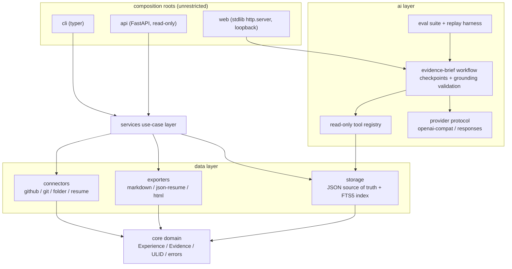

# ExperienceOS

English | [简体中文](README.md)

[](https://github.com/guomengjia618-dot/ExperienceOS/actions/workflows/ci.yml)
[](https://codecov.io/gh/guomengjia618-dot/ExperienceOS)


[](#engineering-quality)

> **Never forget what you have built.** Turn everything you have shipped
> into structured, evidence-backed experience assets.
>
> **中文简介** — ExperienceOS 是一个开源的 AI 个人经历操作系统，把代码、
> 仓库、简历等碎片整理成有证据支撑的经历资产，全部数据存放在你自己的
> 机器上。它**不是**简历生成器。

ExperienceOS is an open-source **personal experience operating system**
for developers. It turns the fragmented traces of what you have built —
code, repositories, GitHub activity, resumes — into structured,
evidence-backed *Experience Assets* that live on your machine, under
your control.

The pain it addresses is universal: you have shipped a lot, but years
later the details are gone; the repos pile up unorganized; interviews
turn into archaeological emergencies. ExperienceOS does exactly one
thing: **convert those fragments into structured experience assets with
receipts**.


## Core principles

1. **Discover, organize, preserve real experiences** — never invent them.
   ExperienceOS is not a resume generator; no packaging, no embellishment.
2. **Claims link to evidence wherever possible.** Every contribution or
   result can carry repo, commit, PR or document evidence.
3. **AI proposes; humans decide.** AI output is always a proposal, stored
   only after explicit confirmation, with `source.created_by` recording
   honestly whether content came from the user or `ai:<model>`.
4. **Local-first.** Your knowledge base is plain JSON files under
   `~/.experienceos/` — human-readable, git-versionable, forever yours.

## Up and running in 5 minutes

### 0) See it work first: the offline workbench (zero configuration)

```bash
python -m venv .venv && source .venv/bin/activate   # Windows: .venv\Scripts\activate
pip install -e .
experienceos web                                    # open http://127.0.0.1:8765
```

The workbench ships with an **offline demo mode**: 3 synthetic sample
experiences plus a deterministic replayed model that walks the full AI
forensics loop — search experiences → read each one → evidence statistics
→ an evidence brief with citations. You can simulate a model outage and
resume from checkpoints. No network, no access to your real data.

### 1) Record real experiences

```bash
experienceos init          # initialize ~/.experienceos
experienceos add           # interactive first entry
experienceos import .      # or import the current project as a draft (below)
experienceos list
experienceos search "search engine inverted index"
```

### 2) Attach a real model (optional)

```bash
experienceos config set ai.model glm-4.7      # GLM / DeepSeek / OpenAI / Ollama
experienceos ai check                          # structured-output connectivity check
experienceos ai eval --live                    # same eval suite on the real model
```

## Import: fragments in, drafts out

Importers only ever produce `status=draft` records, saved after preview
and confirmation; `source` records provenance honestly.

| Source | Command | Notes |
| --- | --- | --- |
| GitHub | `experienceos import github:owner/repo --author username` | Public repos need no token; private activity uses `GITHUB_TOKEN` (env only) |
| Local git repo | `experienceos import /path/to/repo` | Read-only `git log` analysis: window, languages, contribution summary |
| Plain folder | `experienceos import /path/to/folder` | No version history → no invented timeline; blanks stay blank |
| Legacy resume | `experienceos import resume:cv.md` | Rule-based parsing (no LLM), verbatim sentences, source attached as evidence |

## The evidence-brief workflow

`experienceos ai brief "…"` is the project's core idea: **the model is not
allowed to answer out of thin air.**

- The model must inspect the archive through three read-only tools first —
  `search_experiences` → `get_experience` → `get_evidence_stats`;
- Every citation in the brief must correspond to evidence actually loaded
  during the run; a grounding failure pauses the run instead of emitting a
  hallucination;
- Each round persists an **atomic checkpoint** (fsync-backed) that records
  the prompt version — interruptions resume exactly where they stopped; a
  final answer failing schema validation gets **one repair round** before
  the run pauses;
- Run reports are **sanitized** by default: latency, tokens, retries, prompt
  versions — never prompt content, never personal data.

**Testable AI quality** — measured, not vibes:

```bash
$ experienceos ai eval
Evaluation (recorded): 9/9 expectations passed (100%)
tool sequence 100% · schema 100% · grounding 100% · completion 100% · recovery 100%
```

The 9 labelled cases assert tool-call sequences, schema validity, citation
grounding and error recovery; `--live` runs the same suite against a real
model. The dataset ships with a sha256 manifest that states what these
numbers are **not** valid for. Honest boundary: grounding validation is an
*existence* check — it proves cited evidence was actually loaded during the
run, not that the conclusions are semantically entailed; human judgment on
the conclusions remains part of the contract.

**Evidence can be verified** — `experienceos verify` confronts every
GitHub-backed claim with the REST API: repositories, commits (author and
date), pull requests (author / state / merged). Non-GitHub URLs get an
existence probe; local paths are skipped honestly. Exits non-zero when
anything is missing, so it can gate CI.


## Platform & export

```bash
experienceos sync --init      # git-version your home (--push origin; mind privacy)
experienceos backup           # full zip (config included)
experienceos index rebuild    # optional FTS5 index for large libraries
experienceos plugins list     # entry-point plugins (3rd-party connectors/exporters)
pip install 'experienceos[api]' && experienceos-serve   # local REST API (read-only)
```

Exports are faithful projections; only `active` records are exported by
default — drafts never leak:

```bash
experienceos export markdown                    # profile (STAR + evidence)
experienceos export markdown --timeline         # compact by-year table
experienceos export html                        # self-contained page; print = PDF
experienceos export json-resume                 # jsonresume.org compatible
experienceos profile                            # skill timeline / co-occurrence / coverage
experienceos stats --json                       # machine-readable statistics
experienceos verify                             # network-verify GitHub evidence (CI-safe)
```

## Architecture



Layering is enforced by an **AST guard test** (`tests/test_layering.py`):
core depends on nothing above it; ai never touches connectors; services
orchestrate; cli/api/web are composition roots.

## The Experience data model

Every experience is one unified `Experience` abstraction — course
projects, competitions, internships, open source, research, personal
work alike.

```json
{
  "id": "exp_01J...",
  "schema_version": 1,
  "title": "Campus Search Engine",
  "type": "course_project",
  "period": { "start": "2023-01", "end": "2023-06" },
  "context": "Database course project, team of three",
  "role": "Search-engine lead",
  "description": "A lightweight search engine for campus documents",
  "technology": ["Python", "Whoosh"],
  "contribution": ["Designed the inverted index and query pipeline"],
  "challenge": ["Chinese tokenization hurt long-document recall"],
  "solution": ["jieba custom dictionary + hybrid BM25 ranking"],
  "result": ["92% top-10 hit rate in the course evaluation"],
  "reflection": "First time I truly felt why evaluation sets matter.",
  "evidence": [
    { "kind": "repo", "location": "github.com/you/campus-search" }
  ],
  "tags": ["ir", "backend"],
  "status": "active",
  "source": { "origin": "manual", "created_by": "user" }
}
```

Full field reference in `docs/ARCHITECTURE.md`.

## Engineering quality

- **448 passing tests (~90% coverage)**: domain, storage (FTS +
  migrations), connectors, the AI workflow and its evaluation harness,
  web server end-to-end;
- **Crash safety & concurrent-write protection**: every write is fsynced
  before the atomic replace, mutations serialize on a cross-process file
  lock (CLI / API / workbench can run side by side), and a silently
  stale FTS index rebuilds itself from the source of truth;
- **CI matrix**: Ubuntu + Windows × Python 3.10/3.12/3.13, plus a wheel
  packaging job that installs and exercises the artifact outside the
  repo; coverage uploaded to Codecov;
- **AST layering guard**: dependency direction enforced by test, not
  convention;
- **AI eval suite**: deterministic regression + optional live-model runs,
  prompt versions recorded on checkpoints and reports, reports sanitized
  by default;
- **Releases**: tag-driven workflow builds and smoke-tests artifacts,
  publishes GitHub Releases, and supports PyPI trusted publishing.

## Roadmap

| Milestone | Theme | Version | Status |
| --- | --- | --- | --- |
| M0 | Foundation: data model + local storage + CLI | 0.1.0 | ✅ |
| M1 | Import: GitHub / local repo / resume connectors | 0.2.0 | ✅ |
| M2 | Intelligence: AI interview, enrich proposals, guardrails | 0.3.0 | ✅ |
| M3 | Output: Markdown profile / JSON Resume export | 0.4.0 | ✅ |
| M4 | Platform: API service, plugins, FTS index | 0.5.0 | ✅ |
| M5 | Hardening: folder import, layering guard, query semantics | 0.6.0 | ✅ |
| M6 | Workbench: evidence-brief workflow, eval suite, local web workbench | 0.7.0 | ✅ |

The first target users are developers (new grads, engineers, AI
engineers, open-source contributors); the Experience abstraction is
deliberately career-neutral and extends to **designers**, **researchers**
and **creators** (see `docs/ROADMAP.md`).

See `docs/ROADMAP.md` and `docs/issues/` (GitHub-ready issue breakdowns).

## Project layout

```
src/experienceos/
  core/        # domain model: Experience / Evidence / Source + ULID + errors
  storage/     # file store (atomic writes, stat cache) + query engine + FTS
  connectors/  # GitHub / local git / project folder / resume importers
  ai/          # evidence-brief workflow + read-only tools + eval harness + providers
  services/    # use-case layer shared by CLI & API (incl. evidence verification)
  exporters/   # Markdown / JSON Resume / HTML export
  web/         # local browser workbench (zero-dependency http.server + frontend)
  api/         # FastAPI read-only REST API
  cli/         # typer command line
  config.py    # home directory + config.toml
evals/         # 9 labelled AI eval cases + sha256 manifest
examples/      # runnable offline agent demo script
```

## Contributing

Issues and PRs welcome. See [CONTRIBUTING.md](CONTRIBUTING.md).

## License

[MIT](LICENSE) © ExperienceOS Contributors
