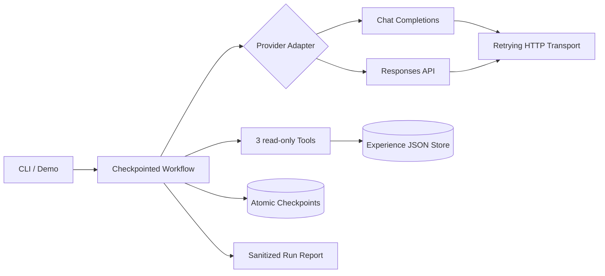

# ExperienceOS

> Never forget what you have built.
>
> **English abstract** — ExperienceOS is an open-source personal experience
> operating system for developers. It turns fragmented traces of what you
> have built (code, repositories, GitHub activity, resumes, conversations)
> into structured, evidence-backed *Experience Assets* that live on your
> machine, under your control. It is **not** a resume generator.

ExperienceOS 是一个开源的 **AI 个人经历操作系统**（Personal Experience
Operating System）。它帮助开发者记录、整理、理解和沉淀自己参与过的所有
项目与创造经历，建立长期的个人经历知识库。

很多开发者都有类似的困境：做过大量项目，几年后却想不起细节；GitHub
仓库一堆，却没有结构化的整理；到了面试或跳槽才临时抱佛脚。项目的真实
价值散落在代码、commit、文档和个人记忆的碎片里。

ExperienceOS 要做的事情只有一件：**把这些碎片转化为有证据支撑的结构化
经历资产（Experience Asset）**。

## 核心理念

1. **发现、整理、保存真实经历** —— 而不是创造经历。ExperienceOS 不是
   简历生成器，不做包装，不夸大事实。
2. **能力描述尽可能关联证据**。每条 contribution / result 都可以挂上
   repo、commit、PR、文档等 Evidence。
3. **AI 只辅助表达，不代替事实**。AI 产出永远是「提案」，经用户确认才
   入库，并且 `source.created_by` 会如实记录内容来自用户还是 `ai:<model>`。
4. **本地优先（Local-first）**。你的经历库是纯 JSON 文件，存放在
   `~/.experienceos/`，人可读、可 git 版本化、永远属于你。

## 快速开始

```bash
# 需要 Python 3.10+
git clone https://github.com/guomengjia618-dot/ExperienceOS.git
cd ExperienceOS
python -m venv .venv && source .venv/bin/activate  # Windows: .venv\Scripts\activate
pip install -e ".[ai,dev,github]"

experienceos init          # 初始化 ~/.experienceos
experienceos add           # 交互式录入第一条经历
experienceos list          # 浏览全部经历
experienceos search "搜索引擎 inverted index"
experienceos show exp_01H  # ID 前缀即可定位
```

### 导入 GitHub 经历

公开仓库可以显式指定贡献者，无需 token：

```bash
experienceos import github:owner/repo --author username
```

省略 `--author` 时，通过 `GITHUB_TOKEN` 获取当前认证用户；token 只从环境
变量读取，不写入配置或经历文件：

```bash
export GITHUB_TOKEN=...  # PowerShell: $env:GITHUB_TOKEN="..."
experienceos import github:owner/repo
```

导入结果始终为 `status=draft`，预览确认后才保存。GitHub 功能使用独立
`[github]` extra，不增加核心安装的运行时依赖。

### 导入本地 Git 仓库

对本地 checkout 做一次只读分析（不联网、不写入仓库），得到时间窗、
语言构成与提交行为摘要：

```bash
experienceos import /path/to/repo                  # 作者默认取 git config user.email
experienceos import /path/to/repo --author me@example.com
```

evidence 挂仓库本地路径；若 `origin` 指向 GitHub 会自动附上仓库 URL。
分析只用 `git log` / `git ls-files`，语言按扩展名内置映射统计。

## Experience 数据模型

每个经历是一个统一的 `Experience` 抽象——不只是代码项目，还包括毕业设计、
课程实践、竞赛、实习、开源贡献、个人作品和研究项目。

```json
{
  "id": "exp_01J...",
  "schema_version": 1,
  "title": "Campus Search Engine",
  "type": "course_project",
  "period": { "start": "2023-01", "end": "2023-06" },
  "context": "数据库课程大作业，三人小组",
  "role": "检索引擎负责人",
  "description": "为校园文档构建的轻量搜索引擎",
  "technology": ["Python", "Whoosh"],
  "contribution": ["设计倒排索引与查询流水线"],
  "challenge": ["中文分词在长文档上召回率低"],
  "solution": ["引入 jieba 自定义词典 + 混合 BM25 排序"],
  "result": ["课程演示中 top-10 命中率 92%"],
  "reflection": "第一次体会到评测集对检索系统的重要性。",
  "evidence": [
    { "kind": "repo", "location": "github.com/you/campus-search" }
  ],
  "tags": ["ir", "backend"],
  "status": "active",
  "source": { "origin": "manual", "created_by": "user" }
}
```

完整字段说明见 `docs/ARCHITECTURE.md`。

## AI Agent 可验证闭环

仓库包含一条端到端 Evidence Brief Workflow。它不是只展示 prompt 的样例：
模型选择 Tool，Tool 读取本地真实数据，最终结果经过结构与证据双重校验，执行状态
可以从检查点恢复。



实现证据：

- 两个真实 API Adapter：保留 OpenAI-compatible Chat Completions，并增加 OpenAI
  Responses API；API Key 只从环境变量读取，不进入配置、消息或检查点。
- 严格结构化输出：请求 JSON Schema，返回后再用 Pydantic 本地校验。
- 3 个实际只读 Tools：`search_experiences`、`get_experience`、
  `get_evidence_stats`。
- 证据护栏：详细结论必须先读取完整记录；引用 ID 和 evidence location 必须来自
  本轮 Tool 结果。
- 可恢复 Workflow：模型轮次和 Tool 结果原子保存；已完成的 `call_id` 不会在
  resume 时重复执行。
- 失败处理：区分 timeout、网络错误、429、5xx 和其他 4xx；支持有限次数的
  exponential backoff + jitter、`Retry-After`、总重试时间预算、request ID 日志。
- 可分享的脱敏报告：记录模型、延迟、tokens、估算成本、Tool 次数、重试次数和
  request ID，不保存问题、回答或 Tool 结果。成本需要在配置中提供价格快照；未配置
  时明确显示为 unavailable，而不是猜测。

### 从干净 clone 复现

```bash
python -m pytest
ruff check .
python examples/agent_demo.py --home .experienceos-demo
experienceos ai eval --report .experienceos-demo/reports/recorded-eval.json
```

离线 Demo 使用录制的模型回复，但 3 个 Tools、真实文件存储、严格 Schema、证据
护栏、检查点和报告全部执行生产代码。固定数据集包含 9 个
`ai-assisted-synthetic` 场景，覆盖 Tool 选择、检索后读取、无证据、拒绝虚构
地址、参数错误、失败恢复、checkpoint/resume、相似经历消歧、空档案和 Schema
失败。录制模式的 9/9 是**确定性回归通过率，不是模型准确率**。

### 真实模型运行

默认配置使用兼容 Chat Completions 的 Adapter。Key 只放环境变量：

```bash
# PowerShell: $env:OPENAI_API_KEY="..."
export OPENAI_API_KEY="..."
experienceos ai check
experienceos ai brief "总结我最强的项目、可验证结果和证据缺口"
experienceos ai eval --live
```

切换 Responses API，只需修改 `<home>/config.toml`：

```toml
[ai]
provider = "openai-responses"
base_url = "https://api.openai.com/v1"
model = "your-model"
api_key_env = "OPENAI_API_KEY"
```

任何网络、模型或 Tool 错误都会保留检查点。修复问题后续跑：

```bash
experienceos ai brief --resume wf_...
```

### 当前验证状态与边界

| 项目 | 状态 |
| --- | --- |
| 无 Key Demo、3 Tools、Schema、grounding、checkpoint/resume | 已实现并由自动测试覆盖 |
| 9 条 AI 辅助起草的合成回归集 | 已实现、未独立人工复核；只表示回归预期，不表示模型准确率 |
| Chat Completions / Responses HTTP Adapter | 已实现并通过 mock HTTP 测试 |
| `ai check` / `ai brief` / `ai eval --live` 在线结果 | **尚未发布：当前开发环境没有 API Key** |
| RAG、MCP、Streaming | 未实现 |
| 生产部署、真实用户结果 | 未实现 / 无数据 |
| 真实线上延迟、tokens、成本 | 无已发布数据；代码只在真实调用后记录 |

因此，这个仓库可以证明 Agent 工程闭环和可复现性，但不声称已完成生产部署、
线上模型准确率或用户效果。RAG 是下一项候选能力；MCP 和 Streaming 不为堆关键词
而提前加入。

实现取舍参考 OpenAI 官方文档：
[model guidance](https://developers.openai.com/api/docs/guides/latest-model)、
[function calling](https://developers.openai.com/api/docs/guides/function-calling)、
[evals](https://developers.openai.com/api/docs/guides/evals)、
[rate limits](https://developers.openai.com/api/docs/guides/rate-limits) 与
[production best practices](https://developers.openai.com/api/docs/guides/production-best-practices)。

## 路线图

| Milestone | 主题 | 版本 | 状态 |
| --- | --- | --- | --- |
| M0 | 基础：数据模型 + 本地存储 + CLI | 0.1.0 | ✅ |
| M1 | 导入：GitHub / 本地仓库 / 简历 Connector | 0.2.0 | 🚧 |
| M2 | 智能：AI 面试录入、enrich 提案、证据护栏 | 0.3.0 | |
| M3 | 输出：Markdown 档案 / JSON Resume 导出 | 0.4.0 | |
| M4 | 平台：API 服务、插件系统、FTS 索引 | 0.5.0 | |

详见 `docs/ROADMAP.md` 与 `docs/issues/`（GitHub-ready 的 Issue 拆分）。

## 项目结构

```
src/experienceos/
  core/        # 领域模型：Experience / Evidence / Source + ULID + 错误体系
  storage/     # 文件存储层（原子写、损坏容忍）+ 内存查询引擎
  connectors/  # GitHub / 本地 Git / 简历等导入器
  ai/          # LLM Provider 协议 + 版本化 Prompt 模板（M2 完善）
  cli/         # typer 命令行界面
  config.py    # home 目录与 config.toml
```

## 参与贡献

欢迎 Issue / PR。开发环境、提交规范与评审流程见
[CONTRIBUTING.md](CONTRIBUTING.md)。

## License

[MIT](LICENSE) © ExperienceOS Contributors
