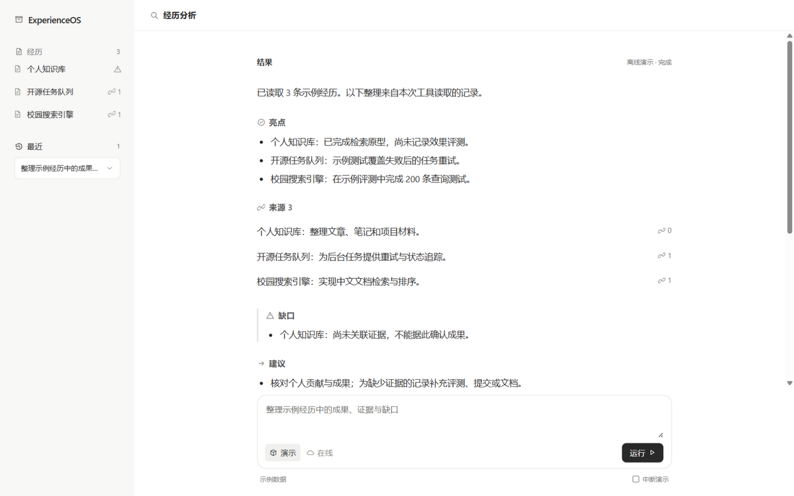
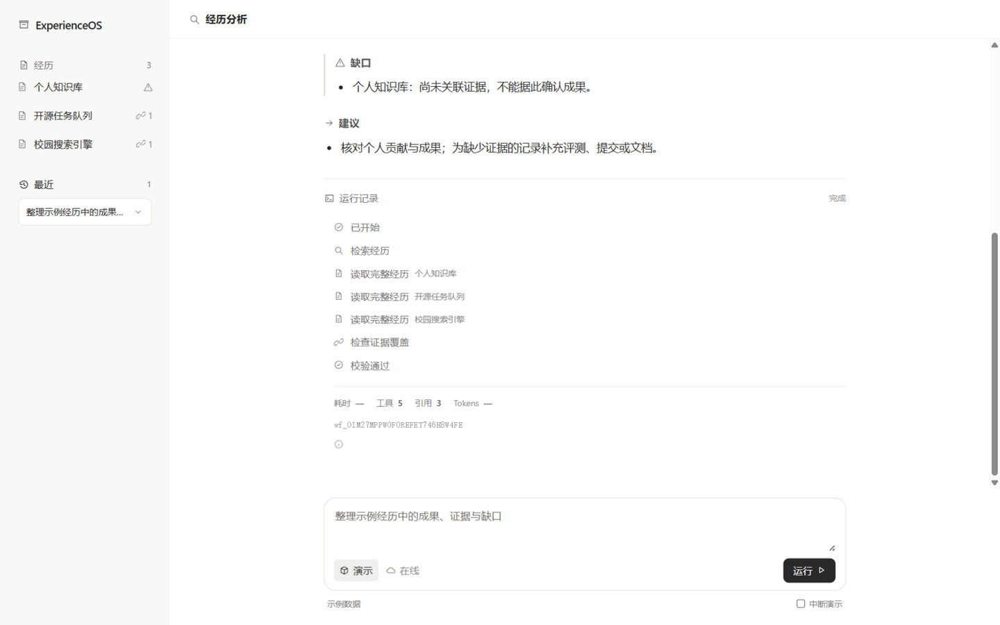
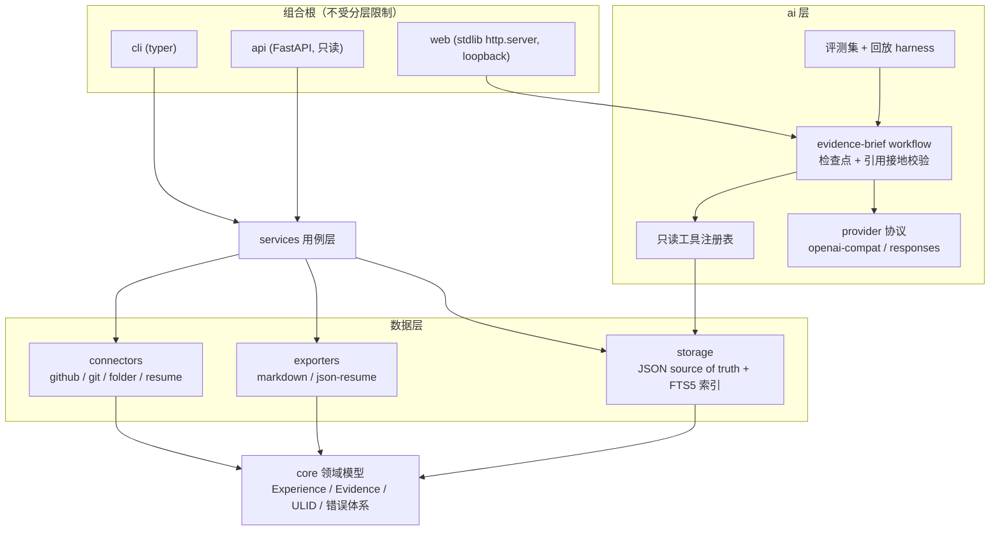

# ExperienceOS

[English](README.en.md) | 简体中文

[](https://github.com/guomengjia618-dot/ExperienceOS/actions/workflows/ci.yml)
[](https://codecov.io/gh/guomengjia618-dot/ExperienceOS)
[](https://pypi.org/project/experienceos/)


[](#工程质量)

> **Never forget what you have built.** 把你做过的每一件事，变成有证据支撑的经历资产。
>
> **English abstract** — ExperienceOS is an open-source personal experience
> operating system for developers. It turns fragmented traces of what you
> have built (code, repositories, GitHub activity, resumes, conversations)
> into structured, evidence-backed *Experience Assets* that live on your
> machine, under your control. It is **not** a resume generator.

ExperienceOS 是一个开源的 **AI 个人经历操作系统**（Personal Experience
Operating System）。它帮助开发者记录、整理、理解和沉淀自己参与过的所有
项目与创造经历，建立长期的个人经历知识库。

很多开发者都有类似的困境：做过大量项目，几年后却想不起细节；GitHub
仓库一堆，却没有结构化的整理；到了面试或跳槽才临时抱佛脚。项目的真实
价值散落在代码、commit、文档和个人记忆的碎片里。

ExperienceOS 要做的事情只有一件：**把这些碎片转化为有证据支撑的结构化
经历资产（Experience Asset）**。



## 核心理念

1. **发现、整理、保存真实经历** —— 而不是创造经历。ExperienceOS 不是
   简历生成器，不做包装，不夸大事实。
2. **能力描述尽可能关联证据**。每条 contribution / result 都可以挂上
   repo、commit、PR、文档等 Evidence。
3. **AI 只辅助表达，不代替事实**。AI 产出永远是「提案」，经用户确认才
   入库，并且 `source.created_by` 会如实记录内容来自用户还是 `ai:<model>`。
4. **本地优先（Local-first）**。你的经历库是纯 JSON 文件，存放在
   `~/.experienceos/`，人可读、可 git 版本化、永远属于你。

## 5 分钟上手

### 0) 先看效果：离线工作台（无需任何配置）

```bash
pip install experienceos        # 或从源码安装:pip install -e .
experienceos web                # 浏览器打开 http://127.0.0.1:8765
```

工作台自带 **离线演示模式**：3 条合成示例经历 + 确定性回放模型，完整演示
AI 取证流程——检索经历 → 逐条读取 → 证据统计 → 生成带引用的证据简报，
还可以模拟「模型中断」并从检查点恢复。全程不联网、不访问你的真实数据。

切到「在线」模式即可**可视化管理真实经历**：表单新建 / 编辑、草稿转正、
删除、一键导出 Markdown / HTML 档案——写操作的信任边界不变：只有坐在
这台机器前的你能改自己的数据。

### 1) 录入真实经历

```bash
experienceos init          # 初始化 ~/.experienceos
experienceos add           # 交互式录入第一条经历
experienceos import .      # 或直接把当前项目导入为草稿（见下文）
experienceos list          # 浏览全部经历
experienceos search "搜索引擎 inverted index"
```

### 2) 接上真实模型（可选）

```bash
experienceos config set ai.model glm-4.7      # GLM / DeepSeek / OpenAI / Ollama 均可
experienceos config set ai.extra_body_json "{\"thinking\":{\"type\":\"disabled\"}}"
                                              # GLM 等思考型模型:结构化输出需关思考
experienceos ai check                         # 结构化输出连通性自检
experienceos ai eval --live                   # 用真实模型跑同一套评测集
```

## 导入：把碎片变成草稿

所有导入器只产 `status=draft` 草稿，预览确认后才入库；`source` 字段
如实记录来源。

| 来源 | 命令 | 说明 |
| --- | --- | --- |
| GitHub | `experienceos import github:owner/repo --author username` | 公开仓库无需 token；私有活动用 `GITHUB_TOKEN`（只读环境变量） |
| 本地 Git 仓库 | `experienceos import /path/to/repo` | 只读 `git log` 分析：时间窗、语言构成、贡献摘要 |
| 普通文件夹 | `experienceos import /path/to/folder` | 无版本控制的项目包；没有可信时间线就诚实留白 |
| 旧简历 | `experienceos import resume:cv.md` | 纯规则解析（不用 LLM），原句不改写，原文挂为证据 |

## AI 证据简报工作流

`experienceos ai brief "…"` 是这个项目的核心创新：**模型不允许凭空作答**。

- 模型必须先通过三个只读工具检查本地档案——`search_experiences` →
  `get_experience` → `get_evidence_stats`；
- 简报中的每一条**引用必须对应本次运行中实际读取到的证据位置**，
  引用不接地（grounding failure）会被判暂停而不是输出幻觉；
- 每一轮对话都持久化为**原子检查点**（fsync 背书），checkpoint 记录
  prompt 版本，模型中断/网络失败后从保存的进度精确恢复；最终输出
  schema 不合法时先做**一轮修复重试**，仍不合法才判暂停；
- 运行报告默认**脱敏**：只有延迟、token、重试、prompt 版本等运营指标，
  绝无 prompt 内容与个人数据。

**可检验的 AI 质量**——不靠感觉，靠评测集：

```bash
$ experienceos ai eval
Evaluation (recorded): 9/9 expectations passed (100%)
tool sequence 100% · schema 100% · grounding 100% · completion 100% · recovery 100%

$ experienceos ai eval --live        # glm-4.7 实测（2026-09）
Evaluation (live model): 8/9 expectations passed (89%)
completion 100% · grounding 100% · schema validity 100%
```

9 条带标签的评测用例断言工具调用、schema 合法性、引用接地和错误恢复。
**录制回放是精确回归**（工具序列全等）；**live 是冒烟语义**（工具覆盖
+ 实质内容任一命中），两者断言强度不同、分开报告。上表 live 唯一失败
是真发现：模型对特定记录的提问连搜 11 次都没加载记录就作答——护栏可以
拒绝幻觉引用，但无法强迫模型读档，这正是评测要暴露的。

数据集附 sha256 manifest，并明确声明这些数字**不**可用于模型准确率
宣传。诚实边界：接地校验是**存在性校验**（引用的证据确实在本次运行中
被读取过），不等于语义蕴含——它保证结论的出处可回溯，不能替代人对
结论的判断。

**证据可以自动核验**——`experienceos verify` 把每条 GitHub 证据拿去
REST API 对证：仓库、commit（含作者与日期）、PR（作者/状态/是否合并），
非 GitHub 链接做存在性探测，本地路径如实跳过；发现失效证据以退出码 1
报告，可接入 CI。



## 平台与导出

```bash
experienceos sync --init      # home 目录 git 化（--push origin 推送，注意私有仓库）
experienceos backup           # 全量打包成 zip（含 config）
experienceos index rebuild    # 可选 FTS 索引（大库加速，可随时删除重建）
experienceos plugins list     # entry-points 插件（第三方 connector/exporter）
pip install 'experienceos[api]' && experienceos-serve   # 本地 REST API（只读）
```

导出物永远是经历的忠实投影，默认只导出 `active` 记录（draft 不外泄）：

```bash
experienceos export markdown                    # 个人档案（STAR + evidence）
experienceos export markdown --timeline         # 按年分组的简表
experienceos export html                        # 自包含网页档案（打印即 PDF）
experienceos export json-resume                 # jsonresume.org 兼容格式
experienceos profile                            # 技能时间线 / 共现 Top-N / 覆盖趋势
experienceos stats --json                       # 机器可读统计
experienceos verify                             # 联网核验 GitHub 证据（可接 CI）
```

## 架构



分层由 **AST 守卫测试**强制执行（`tests/test_layering.py`）：core 不依赖
任何上层；ai 永远不碰 connectors；services 编排一切；cli/api/web 是组合根。

## Experience 数据模型

每个经历是一个统一的 `Experience` 抽象——不只是代码项目，还包括毕业设计、
课程实践、竞赛、实习、开源贡献、个人作品和研究项目。

```json
{
  "id": "exp_01J...",
  "schema_version": 1,
  "title": "Campus Search Engine",
  "type": "course_project",
  "period": { "start": "2023-01", "end": "2023-06" },
  "context": "数据库课程大作业，三人小组",
  "role": "检索引擎负责人",
  "description": "为校园文档构建的轻量搜索引擎",
  "technology": ["Python", "Whoosh"],
  "contribution": ["设计倒排索引与查询流水线"],
  "challenge": ["中文分词在长文档上召回率低"],
  "solution": ["引入 jieba 自定义词典 + 混合 BM25 排序"],
  "result": ["课程演示中 top-10 命中率 92%"],
  "reflection": "第一次体会到评测集对检索系统的重要性。",
  "evidence": [
    { "kind": "repo", "location": "github.com/you/campus-search" }
  ],
  "tags": ["ir", "backend"],
  "status": "active",
  "source": { "origin": "manual", "created_by": "user" }
}
```

完整字段说明见 `docs/ARCHITECTURE.md`。

## 工程质量

- **448 个测试全绿（覆盖率约 90%）**：领域、存储（含 FTS 与迁移）、连接器、
  AI 工作流与评测、web 服务端到端；
- **崩溃安全与并发写保护**：所有落盘写入先 fsync 再原子替换，跨进程写入
  由文件锁串行化（CLI / API / 工作台可并存），FTS 索引陈旧自动重建；
- **CI 矩阵**：Ubuntu + Windows × Python 3.10/3.12/3.13，外加 wheel 打包
  在仓库外安装验证（`ai eval` 从安装产物内运行），覆盖率上报 Codecov；
- **AST 分层守卫**：依赖方向由测试而非约定保证；
- **AI 评测集**：确定性回归 + 可选真模型评测，checkpoint 与报告记录
  prompt 版本，报告默认脱敏。

## 路线图

| Milestone | 主题 | 版本 | 状态 |
| --- | --- | --- | --- |
| M0 | 基础：数据模型 + 本地存储 + CLI | 0.1.0 | ✅ |
| M1 | 导入：GitHub / 本地仓库 / 简历 Connector | 0.2.0 | ✅ |
| M2 | 智能：AI 面试录入、enrich 提案、证据护栏 | 0.3.0 | ✅ |
| M3 | 输出：Markdown 档案 / JSON Resume 导出 | 0.4.0 | ✅ |
| M4 | 平台：API 服务、插件系统、FTS 索引 | 0.5.0 | ✅ |
| M5 | 加固：项目文件夹导入、分层守卫、查询语义统一 | 0.6.0 | ✅ |
| M6 | 工作台：证据简报工作流、评测集、本地浏览器工作台 | 0.7.0 | ✅ |

第一阶段的目标用户是开发者（应届程序员、软件工程师、AI 工程师、开源
贡献者）；Experience 抽象刻意保持职业中立，未来可扩展到**设计师**、
**研究人员**与**创作者**（扩展路径见 `docs/ROADMAP.md` 的「未来用户」）。

详见 `docs/ROADMAP.md` 与 `docs/issues/`（GitHub-ready 的 Issue 拆分）。

## 项目结构

```
src/experienceos/
  core/        # 领域模型：Experience / Evidence / Source + ULID + 错误体系
  storage/     # 文件存储层（原子写、损坏容忍、stat 缓存）+ 查询引擎 + FTS 索引
  connectors/  # GitHub / 本地 Git / 项目文件夹 / 简历等导入器
  ai/          # 证据简报工作流 + 只读工具 + 评测 harness + Provider + 版本化 Prompt
  services/    # 用例层：CLI 与 API 复用的查询 / 导入 / 统计逻辑
  exporters/   # Markdown / JSON Resume 导出
  web/         # 本地浏览器工作台（零依赖 http.server + 静态前端）
  api/         # FastAPI 只读 REST API
  cli/         # typer 命令行界面
  config.py    # home 目录与 config.toml
evals/         # 9 条带标签的 AI 评测用例 + sha256 manifest
examples/      # 可运行的离线 agent 演示脚本
```

## 参与贡献

欢迎 Issue / PR。开发环境、提交规范与评审流程见
[CONTRIBUTING.md](CONTRIBUTING.md)。

## License

[MIT](LICENSE) © ExperienceOS Contributors
